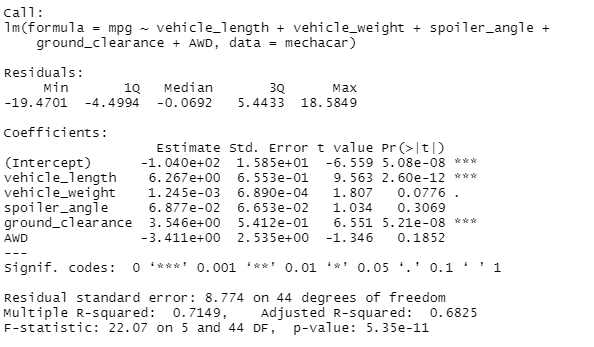
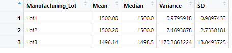
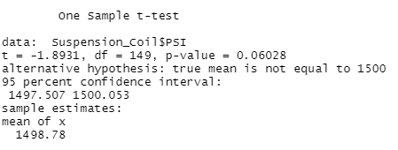
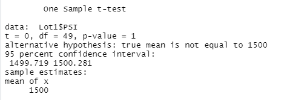

# MechaCar_Statistical_Analysis

An analysis to assist in production issues of the prototype MechaCar.

## Linear Regression to Predict MPG

[Fig1: MPG Linear Regression](other_resources/01_MPG_Linear_Regression.png?raw=true "Figure 1: MPG Linear Regression")

Figure 1 contains a density of information with respect to the relationship between MPG and multiple variables.  As is evident by their respective  P-Values less than .001, the Intercept, Vehicle Length, and Ground Clearance all provide a non-random amount of variance to the mpg values.  Figure 1 also shows the linear regression model's p-value of the F-Statistic to be 5.25e-11, significantly below a 99% threshold, indicating that the null hypothesis be rejected in favor of the null hypothesis that at least one of the coefficients is different than zero.  This model does predict the mpg of MechaCar prototypes effectively, though three variables (vehicle_weight, spoiler_angle, and AWD) should likely be removed for insignificant explanatory power.  Further, the intercept provides some explanatory power, which implies there are other variables which might be effective in explaining the variance of mpg.

	
	
## Summary Statistics on Suspension Coils

[Figure 2a: Suspension Coil Total Summary](other_resources/02a_Total_Summary.png?raw=true "Figure 2a: Suspension Coil Total Summary")

Figure 2a illustrates that the overall manufacturing run variance is within 100 PSI, at 62 PSI.

[Figure 2b: Suspension Coil Lot Summary](other_resources/02b_Lot_Summary.png?raw=true "Figure 2b: Suspension Coil Lot Summary")

Figure 2b shows that Lot 3 violates the stipulation that variance be within 100 PSI, with a value of 170.29 PSI.  Lots 1 and 2 both fall well within the specified paramaters.

## T-Tests on Suspension Coils

[Figure 3a: Total Run T-Test](other_resources/03a_Total_Run_tTest.png?raw=true "Figure 3a: Total Run T-Test")

Figure 3a shows a p-value greater than the significance level of .05, indicating we haven't sufficient evidence to reject the null hypothesis that the mean is different from 1500.  In other words, the overall run PSIs are statistically similar to 1500.

[Figure 3b: Lot 1 T-Test](other_resources/03b_Lot1_tTest.png?raw=true "Figure 3b: Lot 1 T-Test")

Figure 3b shows a very high p-value, indicating that Lot 1 has a mean statistically similar to 1500.

[Figure 3c: Lot 2 T-Test](other_resources/03b_Lot2_tTest.png?raw=true "Figure 3b: Lot 2 T-Test")

Figure 3c exhibits again a p-value greater than the significance level: the mean is statistically similar to the hypothesized value of 1500.

[Figure 3e: Lot 3 T-Test](other_resources/03b_Lot3_tTest.png?raw=true "Figure 3b: Lot 3 T-Test")

Figure 3e shows the t test results for Lot 3.  Evidentally there were production problems in Lot 3, as the p-value is low enough that we can reject the null hypothesis of equality with 1500.  Statitically, the mean PSI is different from 1500 in Lot 3.

## Study Design: MechaCar vs Competition

    
Of paramount importance to budget concious car consumers is maintenance cost of a vehicle over time.  In particular, a lower maintenance cost per unit of price expended for the initial ownership of vehicle is more valuable to the marginal consumer than the alternative.  Thus, the ratio of Maintenance cost to Price (Maint_to_Price) would ideally be low compared to the competition.  At the same time, lower Maintenance Cost to Price ratio indicates room for price increase.

Significant data gathering requirements are necessary for the described analysis.  While price as a variable is not difficult to gather, cost of ownership by age of vehicle is somewhat more difficult.  AAA seems to have the data, but it is not available to the public.  A research budget will likely be necessary to incentivize some random sample of new vehicle owners, across a random spectrum of car brand owners to collect car maintenance cost data over the course of some time period (e.g. 1 year).

Once the data is gathered, the statistical test would be a T-Test comparison of the means of the aforementioned ratio.  The null hypothesis is that the means of Mechanacar Maint_to_Price ratios are less than or equal to competitors, while the alternative hypothesis is that Mechanacar Maint_to_Price ratios are larger than competitors.  This test of means should statistically show that Mechanacar's Maintenance per unit of price is lower than the competition, and by how much prices may be raised.